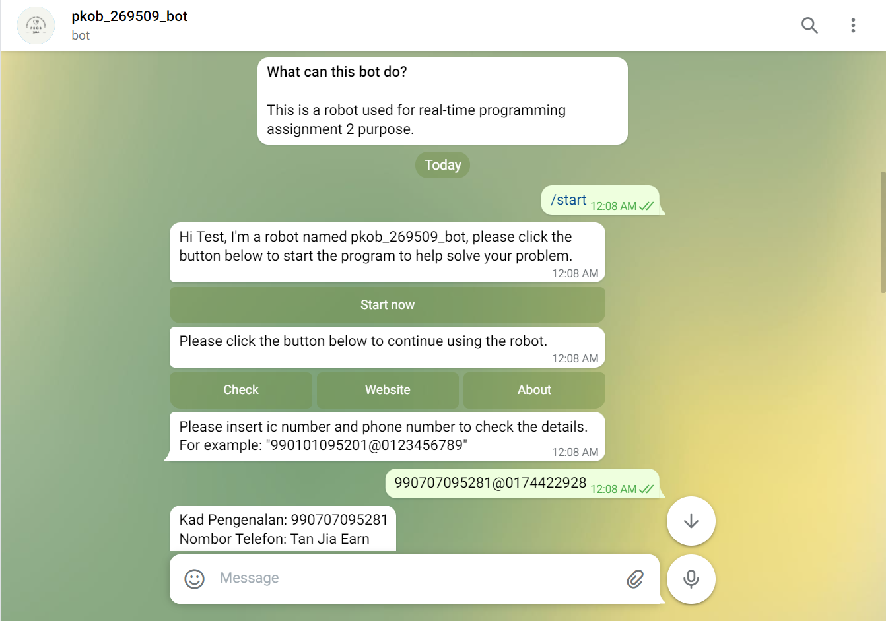
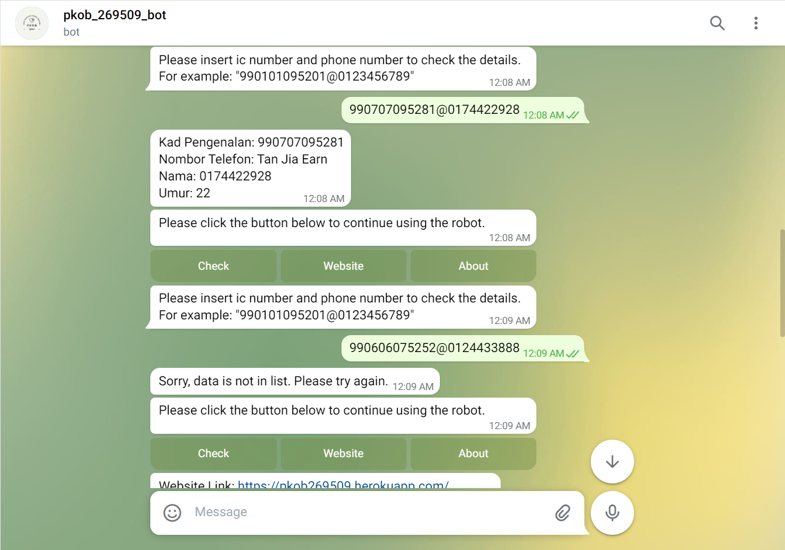
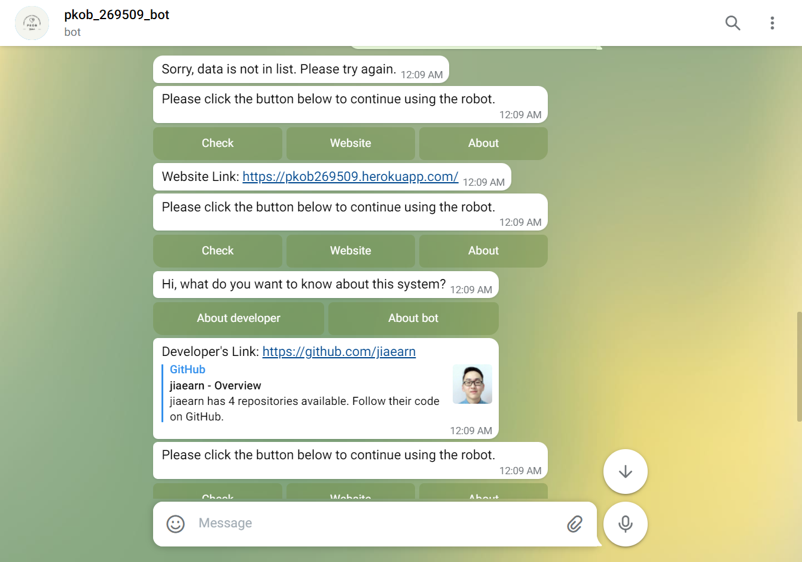
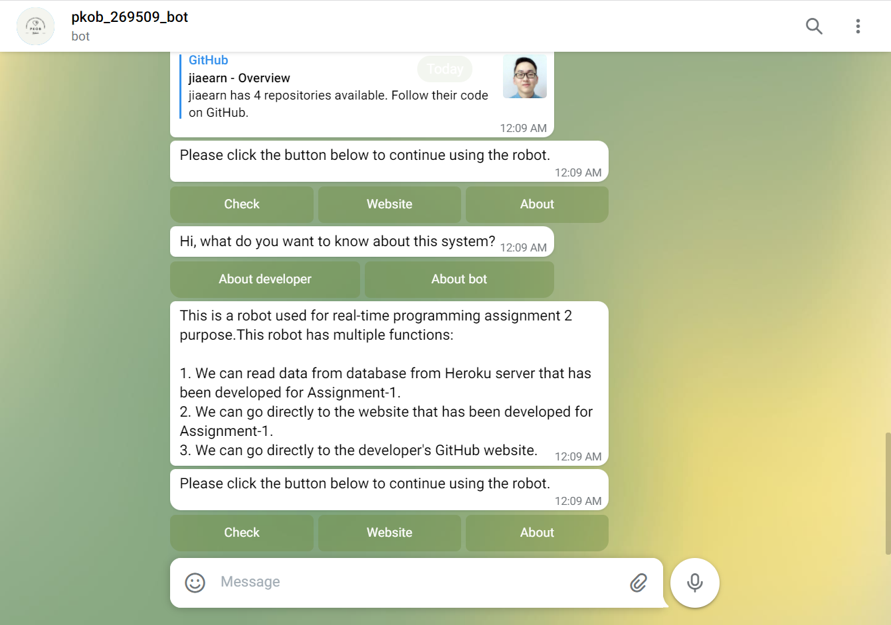

## STIW3054-RealTimeProgramming-Assignment2

## Requirements for Assignment-2
[Read the instruction](https://github.com/STIW3054-A211/e-sulam/blob/main/Assignment-2.md)

## Your Info:
|                 Name                  | Matric No |  Phone Number   |                   Image                   |
| :-----------------------------------: | :-------: | :-------------: | :---------------------------------------: |
| Tan Jia Earn                          |  269509   | +60174422928    |         |

## Introduction

This assignment is about creating a telegram bot that can be connected to Assignment 1, named pkob_269509_bot. In this assignment, pkob_269509_bot provides users with 3 services, that is, read data in the Assignement 1 database, view website links, and view information about developers or bot. 

## Deployment Guide
First, a robot must be created. The method of creation is as follows:
1. Search for BotFather in Telegram
2. Enter the "/newbot" command to create a robot.
3. Enter the name of the robot.
4. Enter the username.
5. Successfully created and obtained a token that can be connected to the robot.

Then, set heroku postgres:
1. Go to Heroku and click on the relevant project
2. After clicking Resources, click "Heroku Postgres"
3. After clicking Settings, click View Credentials.
4. Go back to Assignment 2, update PKOB/settings.py.
5. Migrate again the database.

After that, start coding
1. In Assignment 2, enter "pip install python-telegram-bot" and "pip install django psycopg2" in the terminal.
2. Open a folder and create two python files in the file. One is a file named __init.py, and the other is a file about bots.
3. Use the telegram token and start to enter the code.

Finally, Deploy on Heroku
1. In the Procfile, add a worker to make the telegram bot work.
2. Reset dynos with heroku ps:scale worker=1.
3. Deploy on Heroku.

## Result/Output (Screenshot of the output)
 
 
 

## Youtube Presentation
https://youtu.be/lHNIofbgWjw

## List of Python packages (including the version) used for this system
| Package                   |   Version           |
| :-----------------------: | :-----------------: | 
| APScheduler               |    3.6.3            |
| asgiref                   |    3.4.1            |
| cachetools                |    4.2.2            |
| certifi                   |    2021.10.8        |
| Django                    |    3.2.8            |
| gunicorn                  |    20.1.0           |
| psycopg2                  |    2.9.2            |
| python-telegram-bot       |    13.9             |
| pytz                      |    2021.3           |
| pytz-deprecation-shim     |    0.1.0.post0      |
| six                       |    1.16.0           |
| sqlparse                  |    0.4.2            |
| tornado                   |    6.1              |
| tzdata                    |    2021.5           |
| tzlocal                   |    4.1              |

## References (Not less than 10)

1. NeuralNine. (2021, August 12). <i>Create Your Own Telegram Bot With Python.</i> YouTube. https://www.youtube.com/watch?v=CNkiPN_WZfA

2. Code Palace. (2021, January 25). <i> Creating a Telegram Bot in Python 3.9 Tutorial (Fast & Easy).</i>  YouTube. https://www.youtube.com/watch?v=PTAkiukJK7E

3. <i> Bots: An introduction for developers. </i>  (n.d.). Telegram. https://core.telegram.org/bots

4. <i>Welcome to Python Telegram Bot’s documentation! — python-telegram-bot 13.9 documentation. </i>(n.d.). Python-Telegram-Bot. https://python-telegram-bot.readthedocs.io/en/stable/

5. Ali Abdel Aal, A. A. (2019, July 10). <i>Building Your First Telegram Bot: A Step by Step Guide.</i> Toptal Engineering Blog. https://www.toptal.com/python/telegram-bot-tutorial-python

6. Pythonista (2020). <i>How to Create a Python Telegram Bot [Hacker Tutorial].</i> Finxter. https://blog.finxter.com/python-telegram-bot/

7. <i>Python Examples of telegram.ext.Filters.text.</i> (n.d.). Program Creek. https://www.programcreek.com/python/example/91627/telegram.ext.Filters.text

8. <i>Python Examples of telegram.InlineKeyboardMarkup.</i> (n.d.). Program Creek. https://www.programcreek.com/python/example/93144/telegram.InlineKeyboardMarkup

9. <i> Multiple callback query handlers?</i>  (n.d.). Code Redirect. https://coderedirect.com/questions/549754/multiple-callback-query-handlers

10. Haohui (2021, December 14). <i>How to Deploy a Telegram Bot using Heroku for FREE - Towards Data Science.</i> Towards Data Science. https://towardsdatascience.com/how-to-deploy-a-telegram-bot-using-heroku-for-free-9436f89575d2

11. <i>Intial Deploy to heroku.</i> (n.d.). Awesome Open Source. https://awesomeopensource.com/project/AnshumanFauzdar/telegram-bot-heroku-deploy?category. . .